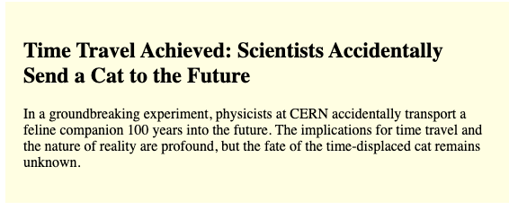

## What am I doing?

### Mission 1 - Simple loading screen

1. You are given the "back end" function `getMainArticle` which returns in 2 seconds with an article or one time in three with an error. In mission one you are to

- update `MainPage.tsx` to call `getMainArticle` (with id=1) and display an article in the `Article` component

- you also need to provide an `InProgress` component while the call is in progress

- in the event of an error, you need to display the `Error` component:

I don't want any styling changes or any changes to the `getMainArticle` function. I also want you to use proper `async` and `.then` is not be allowed as it isn't 2012. I want the code to be clear and concise as possible, but don't build a custome hook, that is mission 2....

### Misson 2 - Custom Hook

Encapsulate the call to `getMainArticle` and the in progress and error handling in a custom hook so that it can be easily utilized by the `MainPage` without polluting the main page with complex code.

### Mission 3 - Custom wrapper component

We can take this hook further right? Given that an error message and in progress message are generic to any call you make, maybe we can make a custom wrapper where we throw it the error message and in progress message and the data (or component) and it just does everything.

### Mission 4 - 2 api calls to get an article

You need to make a call to `getArticleId` and then that is the id that you use to call `getMainArticle`.

### Mission 5 - 3 articles at once

I want three articles to load immediately once the page is loaded; articles 1, 2 and 3. Note that they all load at different speeds, that is by design.

### Mission 6 - 3 articles that only update when all 3 are loaded

All three articles are loaded at the same time like in #5 but they only get displayed when all 3 are loaded. This is for the use case where we don't want to show anything until we have everything.
